## Hey 👋, I'm Yiqing (William) Sun

I'm a Master of Information Systems Management student at Carnegie Mellon University, enrolled in the Fall 2025 cohort.

  <table style="border: none;">
    <tr>
      <th colspan="2" align="center" style="border: none; border-bottom: 1px solid #ccc;">🛠️ Languages and Tools Proficiency</th>
    </tr>
    <tr>
      <td colspan="2" align="center" style="border: none;">
        
        
        
        
        
         
        
        
        
        
        
      </td>
    </tr>
  </table>

## 📈 My GitHub Metrics

  <table style="width: 100%; border: none;">
    <tr>
      <td style="padding: 10px; border: none;">
        
      </td>
    </tr>
    <tr>
      <td style="padding: 10px; border: none;">
        
      </td>
    </tr>
    <tr>
      <td style="padding: 10px; border: none;">
        
      </td>
    </tr>
  </table>

